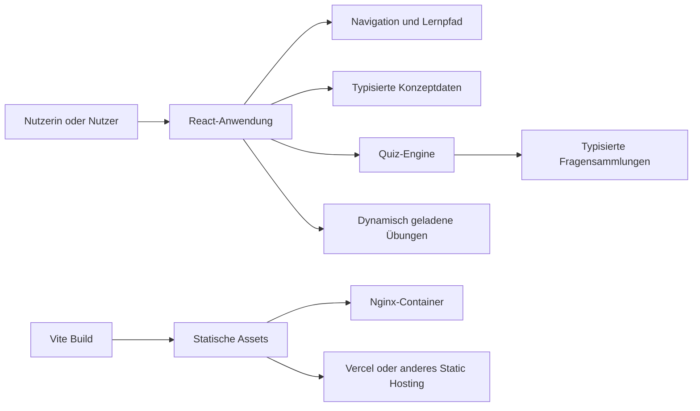

# Architektur

## Zielbild

Die DBS Lernplattform ist eine rein clientseitige React-Anwendung. Sie soll ohne Backend auslieferbar, lokal reproduzierbar und inhaltlich leicht erweiterbar bleiben.

## Schichten

`src/data` enthält die fachlichen Konzept- und Fragensammlungen. Die Dateien besitzen keine UI-Zustände und können unabhängig gepflegt werden.

`src/domain` enthält testbare Geschäftslogik. Die Quiz-Engine mischt Fragen, begrenzt optionale Teilmengen und berechnet Ergebnisse, ohne React oder Browser-APIs zu benötigen.

`src/components` enthält Darstellung und Interaktion. Grundlagen- und Quizkomponenten sind wiederverwendbar; spezialisierte Übungen liegen in `src/components/exercises`.

`src/App.tsx` übernimmt derzeit die interne Seitenauswahl. Kleine, häufig verwendete Komponenten werden direkt gebündelt. Umfangreiche Übungskomponenten werden über `React.lazy` geladen und durch `Suspense` abgesichert.

## Laufzeit und Daten

Die Anwendung arbeitet ohne Serverzustand, Konten, Cookies oder Local Storage. Lernfortschritt gilt nur für die aktuelle Browser-Sitzung. Inhalte kommen ausschließlich aus dem ausgelieferten JavaScript-Bundle.

Unerwartete Renderfehler werden von `AppErrorBoundary` abgefangen. Die Anwendung zeigt einen Wiederherstellungszustand, statt eine leere Seite auszugeben.

## Auslieferung

Der Produktions-Build erzeugt gehashte Dateien in `dist/assets`. Nginx und Vercel liefern diese Dateien mit langfristigem, unveränderlichem Cache aus. HTML- und Anwendungsrouten bleiben davon ausgenommen, damit neue Releases ohne veraltete Einstiegspunkte geladen werden.

Die Content Security Policy ist bewusst noch nicht fest verdrahtet. Vor ihrer Aktivierung sollten Inline-Stile und alle benötigten Vite-/React-Ressourcen in einer realen Staging-Umgebung erfasst und die Richtlinie dort getestet werden.

## Qualitätssicherung

Die CI führt für jeden Pull Request auf `main` statische Analyse, TypeScript-Prüfung, Unit-Tests, den Vite-Produktions-Build und einen Container-Build aus. Dependabot überwacht JavaScript- sowie GitHub-Actions-Abhängigkeiten.
